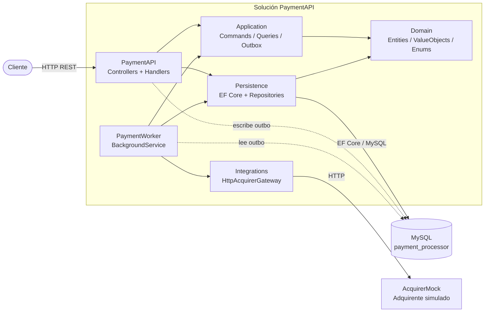
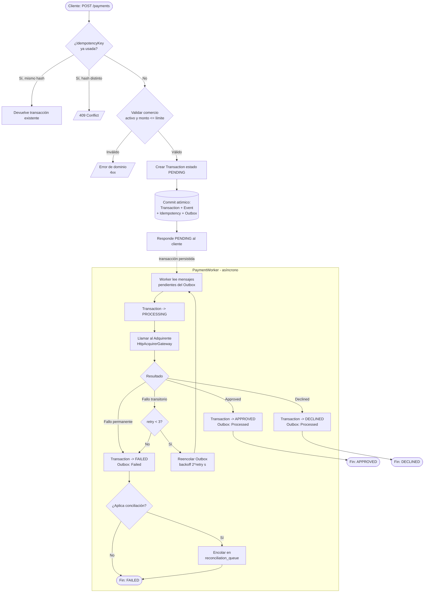
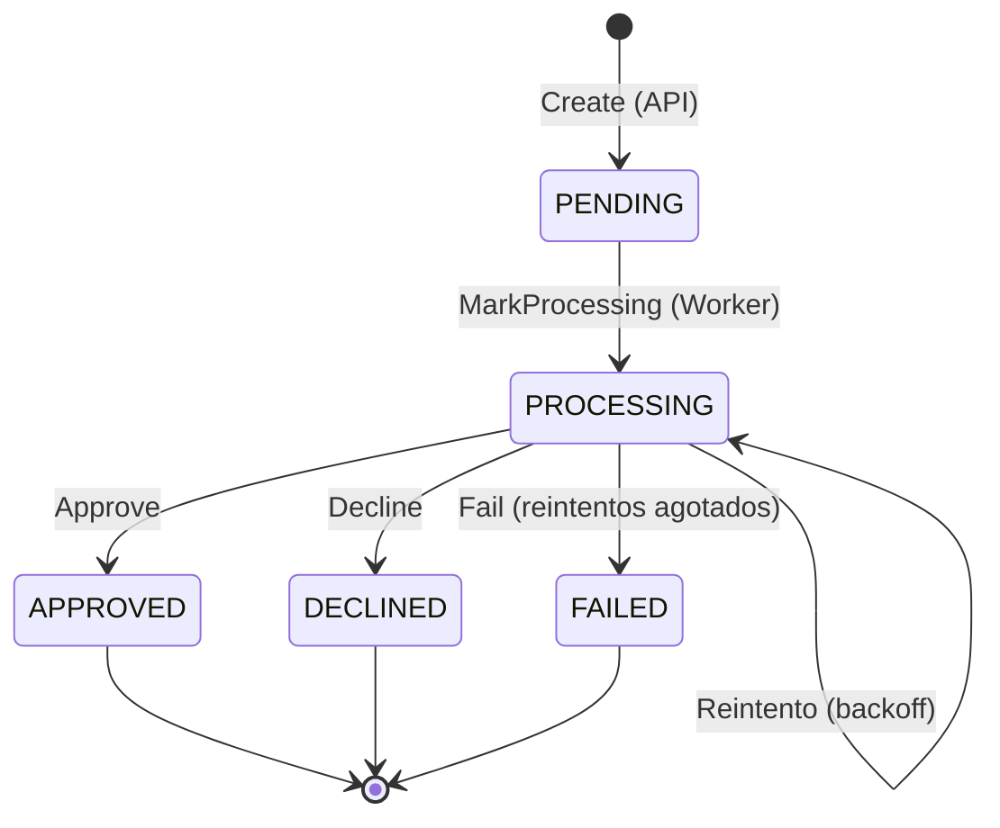

# Payment Processor

Procesador de pagos construido en **.NET / C#** que recibe solicitudes de pago vía API REST, las persiste de forma idempotente y procesa su autorización de manera **asíncrona** contra un adquirente (acquirer), aplicando reintentos con backoff exponencial y un mecanismo de conciliación (reconciliation) ante fallos.

## Tabla de contenidos

- [Requisitos](#requisitos)
- [Ejecución](#ejecución)
- [API](#api)
- [Arquitectura](#arquitectura)
  - [Visión general](#visión-general)
  - [Diagrama de componentes](#diagrama-de-componentes)
  - [Patrones aplicados](#patrones-aplicados)
- [Componentes](#componentes)
  - [PaymentAPI](#paymentapi-host-web)
  - [PaymentWorker](#paymentworker-host-de-background)
  - [Domain](#domain)
  - [Application](#application)
  - [Persistence](#persistence)
  - [Integrations](#integrations)
  - [AcquirerMock](#acquirermock)
  - [Base de datos](#base-de-datos)
- [Ciclo de vida de una transacción](#ciclo-de-vida-de-una-transacción)
  - [Diagrama de flujo](#diagrama-de-flujo)
  - [Estados de la transacción](#estados-de-la-transacción)
- [Detener servicios](#detener-servicios)
- [Reiniciar completamente la base de datos](#reiniciar-completamente-la-base-de-datos)

## Requisitos

- Docker Desktop
- Docker Compose

## Ejecución

Desde la carpeta `payment_processor`:

```bash
docker compose up -d --build
```

## API

Disponible en: `http://localhost:5000`

| Método | Ruta                  | Descripción                                                        |
| ------ | --------------------- | ------------------------------------------------------------------ |
| POST   | `/payments`           | Crea un pago (idempotente vía `IdempotencyKey`).                   |
| GET    | `/payments/{id}`      | Obtiene una transacción por su identificador.                      |
| GET    | `/payments`           | Busca pagos filtrando por `merchant_id` y/o `status`.             |

---

## Arquitectura

### Visión general

La solución sigue una **Clean Architecture / Arquitectura por capas** con separación estricta de responsabilidades, complementada con un modelo de **procesamiento asíncrono** desacoplado mediante el patrón **Transactional Outbox**. Esto permite que la creación del pago (síncrona, rápida) quede aislada de la autorización contra el adquirente (asíncrona, potencialmente lenta o inestable).

El sistema se despliega como **cuatro servicios** orquestados con Docker Compose:

1. **`api`** — recibe y persiste las solicitudes de pago.
2. **`worker`** — procesa las autorizaciones en segundo plano.
3. **`acquirer-mock`** — simula el adquirente externo.
4. **`mysql`** — almacenamiento persistente compartido.

### Diagrama de componentes



### Patrones aplicados

| Patrón | Propósito en el sistema |
| ------ | ----------------------- |
| **Clean Architecture (por capas)** | `Domain` no depende de nada; `Application` depende de `Domain`; `Persistence` e `Integrations` (infraestructura) implementan interfaces declaradas en las capas internas. |
| **CQRS (Command / Query)** | Comandos como `CreatePaymentCommand` y queries como `GetPaymentQuery` / `SearchPaymentQuery` separan escritura de lectura mediante handlers dedicados. |
| **Transactional Outbox** | La API guarda transacción + evento + mensaje outbox en un mismo commit; el worker consume el outbox de forma fiable, garantizando que ningún pago creado quede sin procesar. |
| **Idempotencia** | `IdempotencyKey` + hash de la request evita procesar dos veces la misma solicitud (ventana de 24 h). |
| **Repository + Unit of Work** | Abstraen el acceso a datos y agrupan cambios en transacciones atómicas (`IUnitOfWork.CommitAsync`). |
| **Reintentos con backoff exponencial** | Fallos transitorios del adquirente se reintentan (`2^retry` segundos, máx. 3 intentos). |
| **Reconciliation Queue** | Si tras agotar reintentos o ante un fallo de persistencia post-respuesta la transacción queda en estado inconsistente, se encola para conciliación manual/posterior. |

---

## Componentes

### PaymentAPI (Host web)

API REST (ASP.NET Core) que expone los endpoints de pagos. Recibe el `CreatePaymentRequest`, lo traduce a un `CreatePaymentCommand` y delega en los handlers de la capa `Application`. Configura inyección de dependencias, manejo centralizado de errores (`DomainException` → respuestas HTTP con código y mensaje), Swagger y logging estructurado con **Serilog**.

- `Controllers/PaymentsController.cs` — endpoints `POST /payments`, `GET /payments/{id}`, `GET /payments`.
- `Program.cs` — registro de servicios, `DbContext` (MySQL), middleware de excepciones y pipeline HTTP.

### PaymentWorker (Host de background)

Servicio worker (`BackgroundService`) que ejecuta un bucle continuo (cada 2 s) procesando los mensajes pendientes del **outbox**. Es el responsable de la **autorización asíncrona** de pagos.

- `Services/PaymentAuthorizationWorker.cs` — loop principal; crea un scope por iteración y delega en el processor.
- `Services/PaymentAuthorizationProcessor.cs` — orquesta el ciclo: marca la transacción como `PROCESSING`, llama al adquirente, aplica resultado (`APPROVED` / `DECLINED` / `FAILED`), gestiona reintentos y conciliación.

### Domain

Núcleo del negocio, sin dependencias externas. Contiene la lógica y las invariantes del dominio.

- `Entities/Transaction.cs` — entidad raíz con su máquina de estados (`MarkProcessing`, `Approve`, `Decline`, `Fail`, `IncrementRetry`) y validación de transiciones.
- `Entities/Merchant.cs` — comercio; valida que pueda procesar (`EnsureCanProcess`: activo y dentro del `MaxAmount`).
- `Entities/TransactionEvent.cs` — eventos de auditoría del ciclo de vida de la transacción.
- `Enums/` — `TransactionStatus` (`PENDING`, `PROCESSING`, `APPROVED`, `DECLINED`, `FAILED`), `MerchantStatus`.
- `ValueObjects/`, `Interfaces/`, `Constants/`, `Exceptions/` — `Money`, `CardInfo`, contratos de repositorios y `DomainException`.

### Application

Casos de uso y orquestación. No conoce detalles de infraestructura (depende de interfaces).

- `Payments/Commands/CreatePayment/` — `CreatePaymentHandler`: valida idempotencia, comercio y monto; crea la `Transaction`, registra el evento `TransactionCreated`, guarda el registro de idempotencia y el mensaje de outbox, todo en un único commit.
- `Payments/Queries/` — `GetPaymentHandler`, `SearchPaymentHandler`.
- `Payments/Idempotency/` — `IdempotencyRecord` y hashing de la request.
- `Payments/Outbox/` — `OutboxMessageFactory`, `OutboxMessageData`, `OutboxMessageTypes`, `IOutboxRepository`.
- `Payments/Reconciliation/` — `ReconciliationPolicy`, `ReconciliationPayloadFactory`, `ReconciliationPayload`.

### Persistence

Implementación de acceso a datos con **Entity Framework Core** sobre **MySQL**.

- `Repositories/` — `TransactionRepository`, `MerchantRepository`, `OutboxRepository`, `TransactionEventRepository`, `ReconciliationQueueRepository`, `IdempotencyStore`.
- `Repositories/UnitOfWork.cs` — coordina el commit atómico y el control de tracking de EF Core.
- `Entities/` — `PaymentProcessorContext` (DbContext) y configuración de mapeo.

### Integrations

Adaptadores hacia servicios externos.

- `Acquirers/HttpAcquirerGateway.cs` — implementa `IAcquirerGateway`; realiza la llamada HTTP al adquirente y **clasifica la respuesta**: `Approved`, `Declined`, `TemporaryFailure` (timeouts/5xx → reintentable) o `PermanentFailure` (4xx/errores no recuperables).
- `Acquirers/Contracts/` — DTOs de request/response HTTP.

### AcquirerMock

Servicio independiente (Minimal API) que **simula el adquirente** para pruebas locales.

A diferencia de versiones anteriores (donde la respuesta se determinaba según los últimos 4 dígitos de la tarjeta, `CardLast4`), ahora `Api/AuthorizeService.cs` genera una **respuesta probabilística aleatoria** en cada autorización, independiente de los datos de la tarjeta. Esto permite ejercitar de forma realista todas las rutas del worker (aprobaciones, rechazos y latencia/timeouts) sin depender de tarjetas concretas.

En cada llamada se selecciona un valor de un arreglo ponderado `{ 1, 1, 1, 1, 1, 2, 2, 3, 4, 5 }`, lo que produce la siguiente distribución:

| Caso (`prob`) | Probabilidad | Respuesta del mock |
| ------------- | ------------ | ------------------ |
| `1` | 50 % (5/10) | `APPROVED` — `AuthorizationCode = AUTH123`, `ResponseCode = 00` ("Approved") |
| `2` | 20 % (2/10) | `APPROVED` con **retardo de 2 s** (`Thread.Sleep(2000)`) — simula latencia/timeout del adquirente |
| `3` | 10 % (1/10) | `DECLINED` — `ResponseCode = 51` ("Insufficient funds") |
| `4` | 10 % (1/10) | `DECLINED` — `ResponseCode = 05` ("Transaction declined") |
| `5` | 10 % (1/10) | `DECLINED` — `ResponseCode = 04` ("Retain card") |

> Nota: el retardo de 2 s del caso `2` permite probar el comportamiento de timeouts y reintentos con backoff del `PaymentWorker` frente a respuestas lentas del adquirente.


### Base de datos

Esquema MySQL inicializado vía `database/payment_processor.sql`. Tablas principales:

- `merchants` — comercios y su límite de monto.
- `transactions` — transacciones y su estado.
- `transaction_events` — auditoría de eventos por transacción.
- `outbox_messages` — cola transaccional de mensajes a procesar por el worker.
- `payment_idempotency` — claves de idempotencia (clave compuesta `merchant_id` + `idempotency_key`).
- `reconciliation_queue` — elementos pendientes de conciliación.

---

## Ciclo de vida de una transacción

El procesamiento se divide en dos fases desacopladas por el outbox:

1. **Fase síncrona (PaymentAPI):** validación + persistencia + escritura en outbox. Responde de inmediato con la transacción en estado `PENDING`.
2. **Fase asíncrona (PaymentWorker):** lectura del outbox, autorización contra el adquirente y resolución del estado final.

### Diagrama de flujo



> Nota: si ocurre un fallo de persistencia **después** de recibir respuesta del adquirente, la transacción se registra en `reconciliation_queue` para evitar inconsistencias entre el estado local y el del adquirente.

### Estados de la transacción



Las transiciones inválidas son rechazadas por `Transaction.EnsureCanTransitionTo`, lanzando `transaction.invalid_status_transition`.

---

## Detener servicios

```bash
docker compose down
```

## Reiniciar completamente la base de datos

```bash
docker compose down -v
docker compose up --build
```
